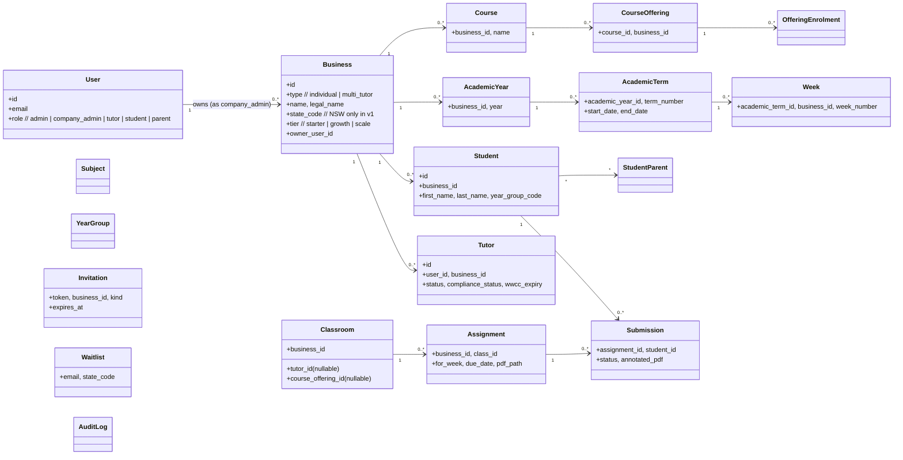
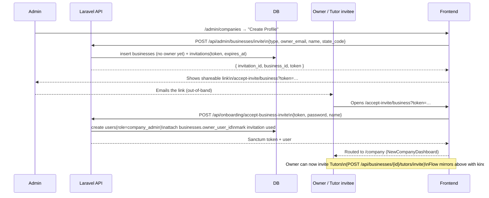
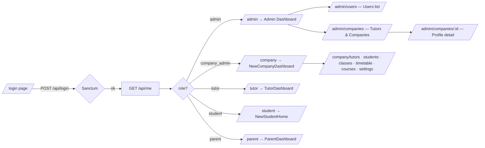
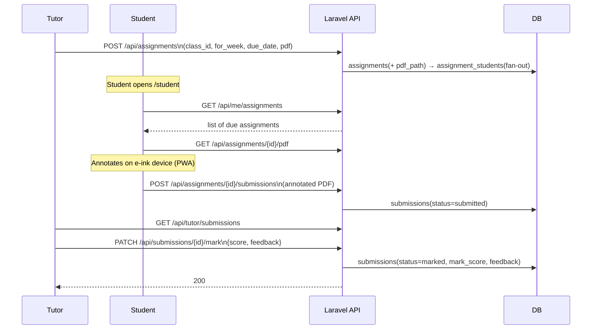
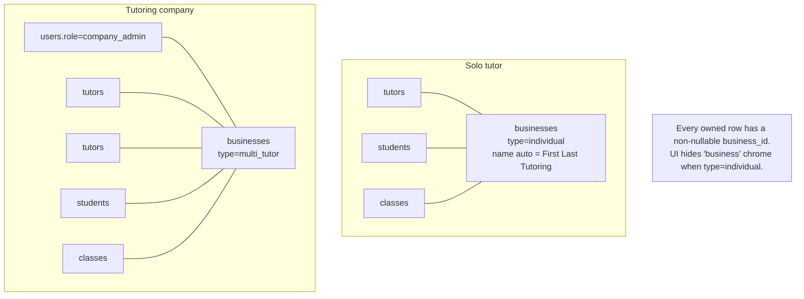
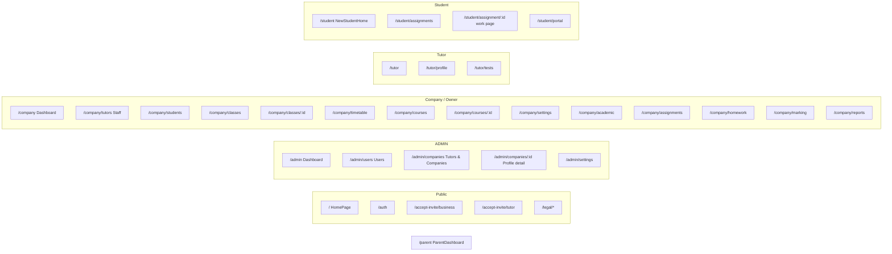

# eSlate — Build Progress & Process Diagrams

**As of:** 2026-05-31 · branch `trupti-dev`
**Source of truth for scope:** [`../mvp-spec.md`](../mvp-spec.md) (and `tutoring_platform_requirements_v3.docx`)

This document is a snapshot of **what has actually been built** — pages, endpoints, migrations — alongside the process flows that the current code supports. It is descriptive, not prescriptive; the spec governs intent, this file reports state.

---

## 1. Snapshot

| Layer | State |
|---|---|
| **Backend** | Laravel 11 + Sanctum at `api/`, port `8001` |
| **Database** | SQLite (`api/database/database.sqlite`) — 37 tables; postgres-shaped schema |
| **Frontend** | React + Vite + TS + Tailwind in `client/`, port `5173` |
| **Auth** | Token (Sanctum); single platform admin `admin@eslate.com / password` |
| **Public signup** | **Closed.** Tutor & company profiles are admin-created via invite |
| **Geography** | NSW only in v1 (schema is multi-state ready) |
| **Roles** | `admin`, `company_admin`, `tutor`, `student`, `parent` |

---

## 2. Domain model



**Shadow Business invariant (v3 §5):** Every tenant — *including solo tutors* — is a `businesses` row. For solo tutors `type=individual` and the row is hidden from the UI. Every owned table (academic, classes, students, …) has a non-nullable `business_id`. One tenancy path, one query pattern.

---

## 3. Process diagrams

### 3.1 Admin-led onboarding (current build)

Public signup is closed. The admin creates every profile via the **invite** flow.



### 3.2 Login → role-based landing



### 3.3 Homework lifecycle (assignment → submission → marking)



### 3.4 Tenancy model (Shadow Business)



---

## 4. What's built — API surface

Routes are declared in `api/routes/api.php`. Public endpoints are limited; everything else sits behind `auth:sanctum`.

### Public
| Method | Path | Controller |
|---|---|---|
| POST | `/login` | `AuthController@login` |
| POST | `/waitlist` | `WaitlistController@store` (non-NSW capture) |
| POST | `/onboarding/accept-business-invite` | `OnboardingController` |
| POST | `/onboarding/accept-tutor-invite` | `OnboardingController` |

### Authenticated — canonical
| Area | Routes |
|---|---|
| Identity | `GET /me`, `POST /logout` |
| Tutor self-service | `POST /me/wwcc`, `GET/PATCH /me/tutor-profile` |
| State packs | `GET /state-packs/{state}/{year}`, `POST /state-packs/apply` |
| Admin onboarding | `POST /admin/businesses/invite` |
| Admin dashboard | `GET /admin/users`, `GET /admin/stats`, `PATCH /admin/users/{user}/status` |
| Business mgmt | `GET/PATCH /businesses/{id}`, `PATCH /businesses/{id}/subjects`, `POST /businesses/{id}/tutors/invite`, `POST /businesses/{id}/students` |
| Reference | `GET /subjects`, `GET /year-groups` |
| Academic | `apiResource /academic-years`, term CRUD |
| Classes | `apiResource /classes`, `/enrol`, `/students/{student}` |
| Courses | `apiResource /courses`, `/course-templates`, `/course-offerings` + enrolments |
| Assignments | `apiResource /assignments`, `/assignments/{id}/pdf`, `GET /me/assignments` |
| Submissions | `POST /assignments/{id}/submissions`, `GET /submissions`, `PATCH /submissions/{id}/mark` |

### Authenticated — legacy shim (`LegacyCompanyController`)
Compatibility layer for the existing React dashboards (originally written against the old Node/Express backend). Highlights:

- `GET /companies` · `GET /companies/{id}` ← *added 91cfef4 to fix Admin Manage button*
- `GET /companies/{id}/tutors · students · classes · audit-log · academic-hierarchy`
- `GET /admin/company-admin/{userId}` · `GET/PATCH /admin/company-settings`
- `POST /admin/create-tutor` · `POST /admin/support-contacts` · `DELETE /admin/support-contacts/{id}`
- `GET /tutor/submissions` · `GET /tutor/incomplete-homework` · `POST /tutor/remind-student`
- `POST /homework/upload-direct` · `POST /submissions/{id}/ai-check` · `GET /uploads/{name}`
- `GET /reports/types · history` · `POST /reports/run`
- `GET /company/submissions` · grade endpoints · `PATCH /students/{id}`

### Database — migrations applied
Domain tables (in dependency order):

```
users → personal_access_tokens
       → businesses → tutors → student_tutors
                   → students → student_parents · student_class_assignments
                   → business_subjects (links subjects)
                   → academic_years → academic_terms → weeks
                   → invitations · audit_log · waitlist
subjects, year_groups (reference)
courses → course_offerings → offering_enrolments → classes (course_offering_id, multi-subject via class_subjects)
course_templates → course_components (test-prep catalogue)
class_terms (pivot — class-collapse refactor)
assignments → assignment_students → submissions
```

Recent migration themes (last ~2 weeks):
- Class collapse — classes absorbed offering fields, `class_terms` pivot
- Multi-subject classes — `class_subjects`, `course_subjects` pivots
- Schedule fields on classes (+ server-side conflict detection)
- Course parent table + catalogue fields on offerings

---

## 5. What's built — Frontend page tree

Routes are defined in `client/src/App.tsx`. Pages reachable today, grouped by role:



### Admin area — recent work
Three commits this week landed the purple admin theme + the broken-link fix:

| Commit | What |
|---|---|
| `aeed1fc` | `/admin` dashboard + `/admin/users` redesigned (purple), real endpoints |
| `ed85baf` | `/admin/companies` list reskinned to purple (clickable stat-card filters) |
| `5db6fd5` | `/admin/companies/:id` detail reskinned to purple |
| `91cfef4` | **Fix:** added missing `GET /api/companies/{id}` so Manage button no longer lands on "Company Not Found" |

---

## 6. Known gaps

These are not bugs to file — they are open work that still routes through known-missing endpoints / pages:

**Admin profile detail page** (`/admin/companies/:id`) calls four endpoints that don't exist on Laravel yet:

| Endpoint | Effect |
|---|---|
| `GET /api/companies/{id}/users` | "All Users" tab stays empty |
| `GET /api/admin/unassigned-tutors` | Unassigned-tutors assign-flow never appears |
| `PATCH /api/companies/{id}` | "Edit details" button errors |
| `PATCH /api/companies/{id}/status` | "Activate / Deactivate" button errors |
| `PATCH /api/companies/{id}/assign-tutor/{tutorId}` | Assign button errors |
| `POST /api/admin/create-user` · `PATCH/DELETE /api/admin/users/{id}` | In-detail user CRUD errors |

**Deferred / planned (per memory):**

- **Auto-create parent accounts** when students get parent contacts, so parents can view kid's progress.
- **Tutor hire, availability, assignment** — operational model for hiring tutors, capturing availability, matching to classes; partly built but significant scope remaining.

**Other:**

- The repo has ~326 pre-existing TypeScript errors (mostly in legacy pages and `client/src/types`); current admin work introduces zero new ones.
- `businesses` table has no `description`, `contact_phone`, `address`, or `is_active` columns yet — the new `showCompany` endpoint returns empty strings for those fields and mirrors `isActive` from `hasOwner` as a placeholder.

---

## 7. Local dev (reproducer)

```powershell
# 1. Laravel API on :8001
& "C:\laragon\bin\php\php-8.3.30-Win32-vs16-x64\php.exe" `
   C:\NT\eSlate\api\artisan serve --host=127.0.0.1 --port=8001

# 2. Vite frontend on :5173 (from project root, NOT api/)
npx vite --port 5173 --host 127.0.0.1
```

Admin login: `admin@eslate.com` / `password`.
Reset DB: `php artisan migrate:fresh --seed` (stop the API server first — SQLite file lock).
